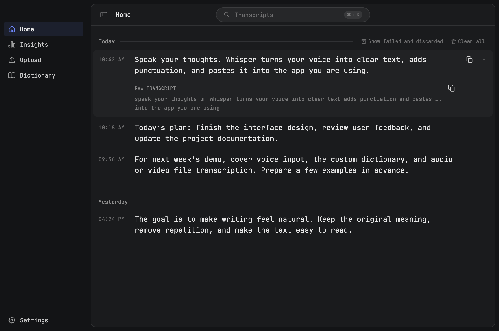

<p align="center">
  
</p>

<h1 align="center">Whisper</h1>

<p align="center">
  <a href="README.md"><kbd>English</kbd></a>
  <a href="README.zh-CN.md"><kbd>简体中文</kbd></a>
</p>

A macOS dictation app for your own speech recognition and text cleanup servers. Speak, and Whisper pastes the text into your current app. Deploy the servers separately and connect them in Settings.

<p align="center">
  
</p>

The interface above uses sample data.

## Features

- Dictate with a global shortcut: double-tap it for hands-free dictation, or switch to Hold mode and hold it while you speak. Shortcuts such as Command+C on the same key do not start dictation. Includes a recording pill, microphone selection, and automatic paste.
- Connect self-hosted speech recognition and text cleanup services, with editable cleanup prompts.
- Keep a custom dictionary, learn from corrections, and expand spoken shortcuts with Snippets.
- Search, copy, delete, and retry local History entries, with configurable audio retention.
- Transcribe audio and video files, individually or in batches.
- View local dictation Insights and choose whether to keep the menu bar icon visible.

This fork focuses on dictation and file transcription. It does not include OpenWhispr Cloud, accounts, sync, meetings, Notes, AI Assistant, or bundled model servers.

## Install

Requires an Apple Silicon Mac with macOS 12 Monterey or later.

```sh
brew install --cask softmaxe/tap/whisper
```

Or download the ARM64 ZIP from [GitHub Releases](https://github.com/softmaxe/whisper/releases/latest) and move `Whisper.app` to `/Applications`. Each release includes a SHA-256 checksum.

To update:

```sh
brew update
brew upgrade --cask softmaxe/tap/whisper
```

Releases use a persistent self-signed certificate and are not notarized. macOS may warn on first launch; upgrading from an older ad-hoc build may require permissions again. See [macOS signing](docs/macos-signing.md).

## Quick start

1. Open **Settings → Speech-to-Text** and enter your ASR server URL and model. The server must support an OpenAI-compatible `/audio/transcriptions` endpoint. Include `/v1` in the URL if your server requires it.
2. Configure your text cleanup server and prompt in **Settings → Text cleanup**. It uses `/v1/chat/completions`.
3. Grant microphone access for recording and Accessibility access for automatic paste. Choose your shortcut and activation mode in **Settings → Hotkeys**.
4. Focus a text field and use the shortcut to dictate. To transcribe existing files, open **Upload**.

Upload uses the same ASR settings and saves raw transcripts to History. It skips text cleanup and Snippets, does not retain source audio, and does not count toward Insights. Results remain copyable when History is disabled.

After an automatic paste, Whisper watches the text field for 30 seconds and adds corrected names and terms to Dictionary. Fixing a single Chinese character, such as 张山 → 张珊, is not learned because it cannot be told apart from an ordinary edit; add such names to Dictionary manually.

Processing stays on your Mac only when your servers run locally. Local and private-network hosts can use HTTP; public hosts require HTTPS. See [Data and permissions](docs/data-and-permissions.md), or use the [custom ASR shim](examples/custom-asr-shim/) for other server APIs.

## Development

Use Node.js 24 from [`.nvmrc`](.nvmrc).

```sh
npm ci
npm run dev
```

Run `npm run quality-check` for lint, TypeScript, translations, and regression tests. `npm run pack` builds an ad-hoc signed development app. See [Tests](test/README.md) for coverage and CI, and [macOS signing](docs/macos-signing.md) for release builds.

## License

[MIT](LICENSE). Forked from [OpenWhispr](https://github.com/OpenWhispr/openwhispr) 1.10.2 at commit `834a0771`, with its attribution retained. Bundled JetBrains Mono fonts use [OFL-1.1](src/assets/fonts/jetbrains-mono/OFL.txt).
