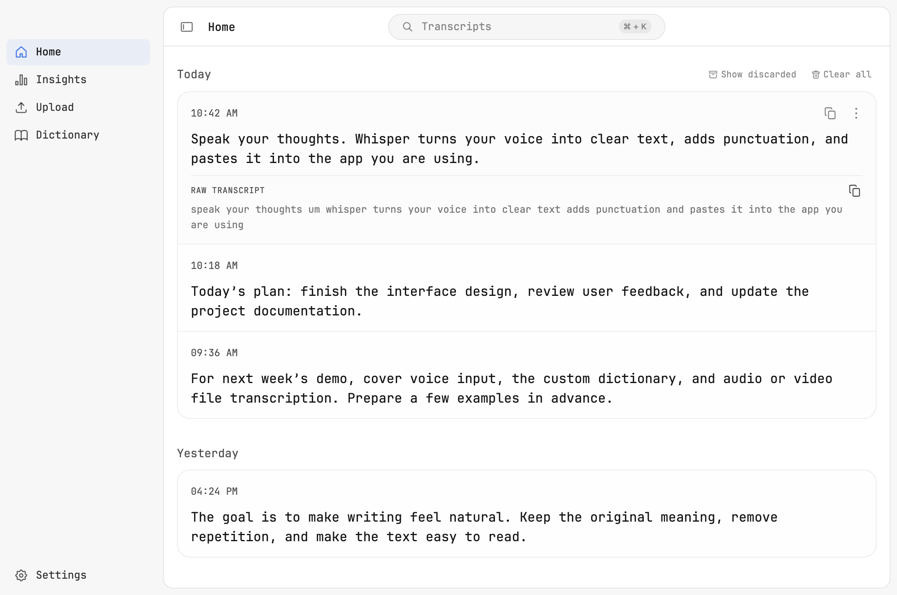

<p align="center">
  
</p>

<h1 align="center">Whisper</h1>

<p align="center">
  <a href="README.md"><kbd>English</kbd></a>
  <a href="README.zh-CN.md"><kbd>简体中文</kbd></a>
</p>

Whisper turns speech into text and pastes it into the app you're using on your Mac. It connects to a speech recognition server that you deploy separately. Add a text cleanup server to fix punctuation and remove filler words.

<p align="center">
  
</p>

The screenshot uses sample data. See [demo](demo/README.md) to render the hand-drawn explainer video in English or Chinese.

## Features

- Dictate with a global shortcut in hands-free or Hold mode. Choose a microphone and follow recording progress in a floating pill.
- Connect self-hosted speech recognition and optional text cleanup services. Edit the cleanup prompt to suit your writing.
- Add names and terms to Dictionary, learn from corrections, and expand spoken phrases with Snippets.
- Search, copy, and delete local History entries. Retry dictations while their audio is still saved, and set how long to keep transcripts and audio.
- Transcribe audio and video files, individually or in batches.
- View local dictation statistics in Insights and show or hide the menu bar icon.

This fork focuses on dictation and file transcription. It does not include OpenWhispr Cloud, accounts, sync, meetings, Notes, AI Assistant, or bundled model servers.

Only self-hosted servers are supported. Hosted provider APIs are outside the supported scope, including when entered as OpenAI-compatible server URLs. Whisper sends generic OpenAI-compatible requests without provider-specific URL, header, or parameter handling; hosted endpoints may reject them. Server URLs must be configured explicitly.

## Install

Requires an Apple Silicon Mac with macOS 12 Monterey or later.

```sh
brew install --cask softmaxe/tap/whisper
```

Or download the ARM64 ZIP from [GitHub Releases](https://github.com/softmaxe/whisper/releases/latest) and move `Whisper.app` to `/Applications`. Each release includes a SHA-256 checksum.

To update:

```sh
brew update
brew upgrade --cask softmaxe/tap/whisper
```

Releases use the same self-signed certificate across versions and are not notarized. macOS may warn on first launch. Upgrading from an older ad-hoc build may require permissions again. See [macOS signing](docs/macos-signing.md).

## Quick start

1. In Settings > Speech-to-Text, enter your speech recognition server URL and model. The server must support an OpenAI-compatible `/audio/transcriptions` endpoint. Include `/v1` in the URL if your server requires it.
2. In Settings > Text cleanup, enter the cleanup server URL and model, plus an API key if required. The server must support `/v1/chat/completions`. You can edit the prompt here or turn off text cleanup to use speech recognition alone.
3. Grant microphone access for recording and Accessibility access for automatic paste. Choose your shortcut and activation mode in Settings > Hotkeys.
4. Focus a text field and use the shortcut to dictate.

### Dictation

- In Double-tap mode, double-tap Globe/fn to start hands-free dictation, then press it once to finish. Key combinations start and stop with a single press.
- In Hold mode, hold the shortcut while speaking and release it to finish. Use a key that supports release detection, such as Globe/fn, a right-side modifier, or a modifier key combination.

Using a modifier in another shortcut, such as Command+C, does not trigger dictation. If Whisper cannot paste into the target app, it shows the transcript in a panel where you can copy it and paste manually.

The recording pill appears when you start dictation and disappears after the session and its feedback finish. It stays hidden while idle.

### File transcription

Open Upload to transcribe audio or video files, one at a time or in batches. Upload uses the same speech recognition settings and saves raw transcripts to History when History is enabled. It skips text cleanup and Snippets, does not retain source audio, and does not count toward Insights. You can still copy results in Upload when History is disabled.

### Correction learning

When Auto-learn from corrections is enabled in Settings > Preferences, Whisper watches the text field for 30 seconds after an automatic paste. It adds recognized name and term corrections to Dictionary. The target app must expose the text field through macOS Accessibility.

Single-character Chinese corrections, such as changing 张山 to 张珊, are not learned. Add these names to Dictionary manually.

## Data and permissions

Speech recognition sends audio to your configured server. Text cleanup sends the transcript and prompt to the cleanup server. To keep processing on your Mac, run each service you use locally.

Local and private-network hosts can use HTTP. Public hosts require HTTPS. See [Data and permissions](docs/data-and-permissions.md) for storage and permission details, or use the [custom ASR shim](examples/custom-asr-shim/) to connect other speech recognition APIs.

## Development

Use Node.js 24 from [`.nvmrc`](.nvmrc).

```sh
npm ci
npm run dev
```

Run `npm run quality-check` for lint, TypeScript, translation checks, and regression tests. `npm run pack` builds an ad-hoc signed development app.

See [Tests](test/README.md) for coverage and CI, and [macOS signing](docs/macos-signing.md) for release builds.

## License

[MIT](LICENSE). Forked from [OpenWhispr](https://github.com/OpenWhispr/openwhispr) 1.10.2 at commit `834a0771`, with its attribution retained. Bundled JetBrains Mono fonts use [OFL-1.1](src/assets/fonts/jetbrains-mono/OFL.txt).
