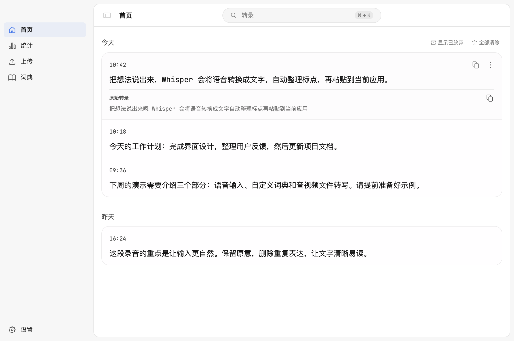

<p align="center">
  
</p>

<h1 align="center">Whisper</h1>

<p align="center">
  <a href="README.md"><kbd>English</kbd></a>
  <a href="README.zh-CN.md"><kbd>简体中文</kbd></a>
</p>

连接自建语音识别和文本整理服务的 macOS 听写应用。说完后，文字自动粘贴到正在使用的应用。服务需要单独部署，再到设置中填写连接信息。

https://github.com/user-attachments/assets/a5c75987-fc24-4ef6-94f2-efdf130c2087

<p align="center">
  
</p>

上方视频和应用界面均使用示例数据。

## 功能

- 通过全局快捷键听写：双击进入免提听写，也可切换为按住模式，按住说话。用同一个键按 Command+C 等组合键不会触发听写。支持录音悬浮条、麦克风选择和自动粘贴。
- 连接自建语音识别和文本整理服务，自定义整理提示词。
- 维护个人词典、学习文字纠正，用语音短语展开文本片段。
- 搜索、复制、删除和重试本地历史记录，设置录音保留期限。
- 转录音频和视频文件，支持批量上传。
- 查看本地听写统计，自由开启或关闭常驻菜单栏图标。

此分支专注于听写和文件转录，不包含 OpenWhispr Cloud、账号、同步、会议、笔记、AI 助手或内置模型服务。

## 安装

需要搭载 Apple Silicon 的 Mac，运行 macOS 12 Monterey 或更高版本。

```sh
brew install --cask softmaxe/tap/whisper
```

也可以从 [GitHub Releases](https://github.com/softmaxe/whisper/releases/latest) 下载 ARM64 ZIP，将 `Whisper.app` 移到 `/Applications`。每个版本均附有 SHA-256 校验值。

更新：

```sh
brew update
brew upgrade --cask softmaxe/tap/whisper
```

发布版使用固定的自签名证书，未经 Apple 公证。macOS 首次打开时可能提示警告；从旧的 ad-hoc 签名版本升级时，可能需要重新授权。详见 [macOS 签名说明](docs/macos-signing.md)。

## 快速开始

1. 打开「设置 → 语音转文字」，填写 ASR 服务地址和模型名称。服务需支持 OpenAI 兼容的 `/audio/transcriptions` 接口；如果服务要求 `/v1` 前缀，请在地址中保留。
2. 在「设置 → 文本整理」中配置整理服务和提示词，使用 `/v1/chat/completions` 接口。
3. 授予麦克风权限以录音，授予辅助功能权限以自动粘贴。在「设置 → 快捷键」中选择听写快捷键和激活模式。
4. 将光标放到输入框，使用快捷键开始听写。转录已有文件时，打开「上传」。

上传使用相同的 ASR 配置，将原始转录保存到历史记录，不进行文本整理或片段展开，不保留源音频，也不计入听写统计。关闭历史记录后，仍可复制上传结果。

自动粘贴后，Whisper 会在 30 秒内监听输入框，把纠正后的名称和术语加入词典。只改一个汉字的纠正（例如 张山 → 张珊）无法与普通修改区分，不会被学习；这类名称请手动加入词典。

只有服务在本机运行时，处理才完全留在本机。本机和私有网络地址可使用 HTTP，公网地址必须使用 HTTPS。详见[数据与权限](docs/data-and-permissions.md)；其他服务接口可通过[自定义 ASR 适配器](examples/custom-asr-shim/)接入。

## 开发

使用 [`.nvmrc`](.nvmrc) 指定的 Node.js 24。

```sh
npm ci
npm run dev
```

`npm run quality-check` 检查 lint、TypeScript、翻译和回归测试。`npm run pack` 构建 ad-hoc 签名的开发版应用。测试范围与 CI 见[测试说明](test/README.md)，发布构建见 [macOS 签名说明](docs/macos-signing.md)。演示视频由 [demo](demo/README.md) 中的代码渲染生成。

## 许可证

[MIT](LICENSE)。基于 [OpenWhispr](https://github.com/OpenWhispr/openwhispr) 1.10.2 的 `834a0771` 提交，保留上游署名。内置 JetBrains Mono 字体采用 [OFL-1.1](src/assets/fonts/jetbrains-mono/OFL.txt)。
