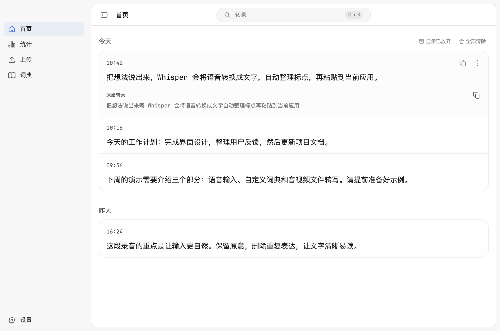

<p align="center">
  
</p>

<h1 align="center">Whisper</h1>

<p align="center">
  <a href="README.md"><kbd>English</kbd></a>
  <a href="README.zh-CN.md"><kbd>简体中文</kbd></a>
</p>

Whisper 将语音转成文字，粘贴到 Mac 上正在使用的应用。你需要单独部署语音识别服务，再到设置中连接。也可以接入文本整理服务，修正标点、去掉语气词。

https://github.com/user-attachments/assets/e843849f-951e-49a4-bb52-a283c7349164

<p align="center">
  
</p>

视频和截图使用示例数据。视频由 [demo](demo/README.md) 中的代码生成。

## 功能

- 通过全局快捷键免提听写或按住说话，选择麦克风，用悬浮条查看录音状态。
- 连接自建语音识别服务，按需启用文本整理，自定义整理提示词。
- 将名称和术语加入词典，从纠正中学习，用语音短语展开文本片段。
- 搜索、复制和删除本地历史记录。录音仍在时可重试听写，文字和录音均可设置保留期限。
- 转录音频和视频文件，支持批量上传。
- 查看本地听写统计，显示或隐藏菜单栏图标。

此分支专注于听写和文件转录，不包含 OpenWhispr Cloud、账号、同步、会议、笔记、AI 助手或内置模型服务。

仅支持自建服务。托管服务商的 API 不在支持范围内，即使以 OpenAI 兼容服务地址的形式填写也是如此。Whisper 发送通用的 OpenAI 兼容请求，不针对特定服务商处理地址、请求头或参数，托管接口可能会拒绝这些请求。服务地址需要手动明确配置。

## 安装

需要搭载 Apple Silicon 的 Mac，运行 macOS 12 Monterey 或更高版本。

```sh
brew install --cask softmaxe/tap/whisper
```

也可以从 [GitHub Releases](https://github.com/softmaxe/whisper/releases/latest) 下载 ARM64 ZIP，将 `Whisper.app` 移到 `/Applications`。每个版本均附有 SHA-256 校验值。

更新：

```sh
brew update
brew upgrade --cask softmaxe/tap/whisper
```

各发布版使用同一张自签名证书，未经 Apple 公证。macOS 首次打开时可能提示警告。从旧的 ad-hoc 签名版本升级时，可能需要重新授权。详见 [macOS 签名说明](docs/macos-signing.md)。

## 快速开始

1. 在「设置 > 语音转文字」中填写语音识别服务地址和模型名称。服务需支持 OpenAI 兼容的 `/audio/transcriptions` 接口。如果服务要求 `/v1` 前缀，请在地址中保留。
2. 在「设置 > 文本整理」中填写整理服务地址和模型名称，服务需要认证时再填写 API key。服务需支持 `/v1/chat/completions` 接口。你可以在这里修改提示词，也可以关闭文本整理，只使用语音识别。
3. 授予麦克风权限以录音，授予辅助功能权限以自动粘贴。在「设置 > 快捷键」中选择听写快捷键和激活模式。
4. 将光标放到输入框，使用快捷键开始听写。

### 听写操作

- 双击模式下，双击 Globe/fn 键开始免提听写，再按一下结束。如果使用组合键，按一下开始，再按一下结束。
- 按住模式下，按住快捷键说话，松开即结束。需要使用能检测到松开的按键，例如 Globe/fn、右侧修饰键或包含修饰键的组合键。

将修饰键用于 Command+C 等其他快捷键时，不会触发听写。如果 Whisper 无法粘贴到目标应用，会弹出转录文本面板，供你复制后手动粘贴。

开始听写时会出现录音悬浮条，听写及其反馈结束后消失，空闲时不显示。

### 文件转录

打开「上传」转录音频或视频文件，支持单个文件和批量上传。上传使用相同的语音识别配置，开启历史记录时会保存原始转录。上传不进行文本整理或片段展开，不保留源音频，也不计入听写统计。关闭历史记录后，仍可在上传页面复制结果。

### 纠错学习

在「设置 > 偏好设置」中启用「从纠正中自动学习」后，Whisper 会在自动粘贴后的 30 秒内监听输入框，将识别出的名称和术语纠正加入词典。目标应用需要允许 macOS 辅助功能读取输入框。

只改一个汉字的纠正不会被学习，例如将张山改为张珊。这类名称请手动加入词典。

## 数据与权限

语音识别会将音频发送到你配置的服务，文本整理会将转录文字和提示词发送到整理服务。若要让处理完全留在 Mac 上，所用服务都需要在本机运行。

本机和私有网络地址可使用 HTTP，公网地址必须使用 HTTPS。存储和权限详情见[数据与权限](docs/data-and-permissions.md)。其他语音识别接口可通过[自定义 ASR 适配器](examples/custom-asr-shim/)接入。

## 开发

安装 [mise](https://mise.jdx.dev/)，由它提供 [`mise.toml`](mise.toml) 固定的 Node.js 和 pnpm 版本。

```sh
mise install
pnpm install --frozen-lockfile
pnpm run dev
```

`pnpm run quality-check` 执行 lint、TypeScript、翻译检查和回归测试。`pnpm run pack` 构建 ad-hoc 签名的开发版应用。

测试范围与 CI 见[测试说明](test/README.md)，发布构建见 [macOS 签名说明](docs/macos-signing.md)。

## 许可证

[MIT](LICENSE)。基于 [OpenWhispr](https://github.com/OpenWhispr/openwhispr) 1.10.2 的 `834a0771` 提交，保留上游署名。内置 JetBrains Mono 字体采用 [OFL-1.1](src/assets/fonts/jetbrains-mono/OFL.txt)。
